# Smart Recipe Finder - Project Proposal

---

## Overview

**Smart Recipe Finder** is a web application that helps users discover recipes based on the ingredients they already have on hand. Users enter a list of available ingredients and receive curated recipe suggestions powered by the **Spoonacular API**. The app also integrates the **Edamam API** to display nutritional information such as calories, macronutrients, and dietary breakdowns.

**The Problem:** Many people struggle with meal planning, food waste, and knowing what to cook with limited ingredients. Grocery trips become repetitive, and unused ingredients go bad.

**Motivation:** This app empowers users to make the most of what's in their kitchen, save money, reduce food waste, and make informed dietary choices — all from one simple interface.

---

## Target Audience

- **Home cooks** looking for quick meal inspiration from available ingredients
- **Budget-conscious individuals** who want to minimize grocery spending
- **Health-conscious users** who track nutritional intake and macronutrients
- **Students and young professionals** learning to cook with limited pantry items
- **Busy families** seeking fast meal planning solutions

---

## Major Functions

| # | Function | Description |
|---|----------|-------------|
| 1 | **Ingredient-Based Recipe Search** | Users type or select ingredients they have available. The app queries the Spoonacular API to return recipes that match those ingredients. |
| 2 | **Recipe Detail View** | Displays full recipe details including instructions, cook time, servings, and a summary. Users can drill into a specific recipe from search results. |
| 3 | **Nutritional Information Display** | For each recipe, the Edamam API provides calorie count, macronutrient breakdown (protein, carbs, fat), and other dietary data. |
| 4 | **User Authentication (Sign Up / Login)** | Users can create an account and log in to save preferences, favorite recipes, and profile settings. |
| 5 | **User Profile & Settings** | Authenticated users can manage dietary preferences (e.g., vegan, gluten-free), allergen filters, and account details. |
| 6 | **Search Results Filtering & Sorting** | Results can be filtered by cuisine type, diet, meal type, and sorted by cook time, relevance, or calories. |
| 7 | **Favorite / Save Recipes** | Logged-in users can bookmark recipes to a personal collection for quick access later. |
| 8 | **Responsive Design (Mobile & Desktop)** | The application is fully responsive, providing optimized experiences for both mobile and desktop browsers. |
| 9 | **Popular / Trending Recipes** | The home screen showcases popular or trending recipes for users who want inspiration without entering specific ingredients. |
| 10 | **Error Handling & Input Validation** | Graceful handling of empty searches, API failures, and invalid inputs with clear user-facing messages. |

---

## Wireframes

### Desktop Wireframes

**Home / Input Screen**
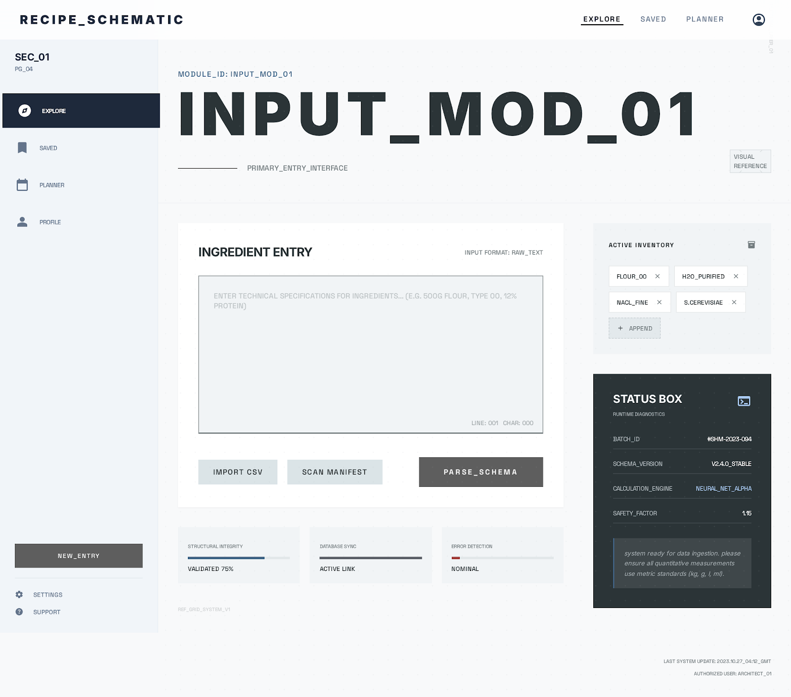

**Login Screen**
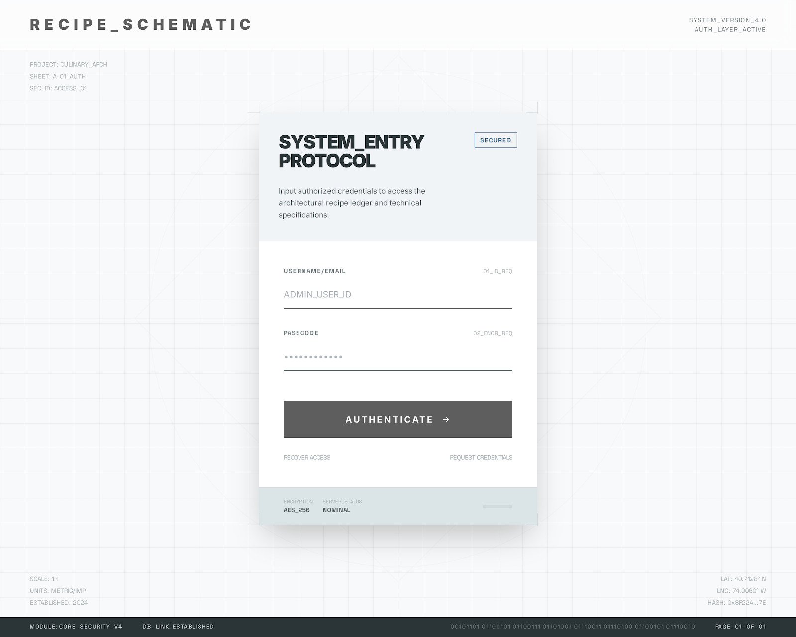

**Sign Up Screen**
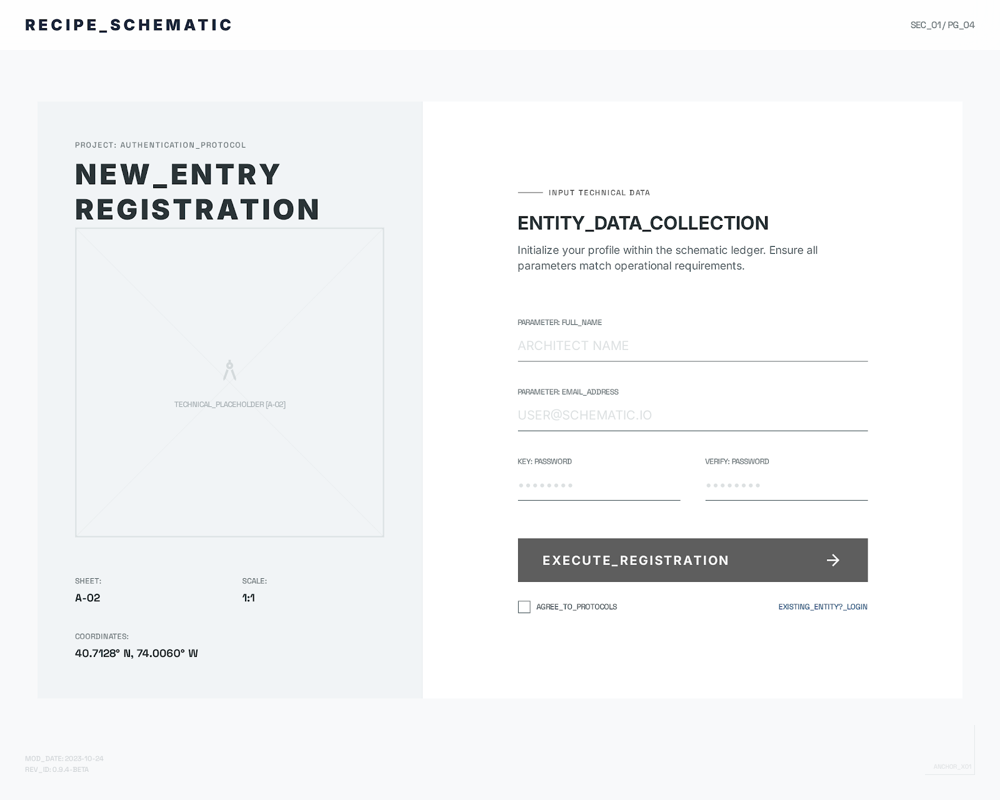

**Search Results**
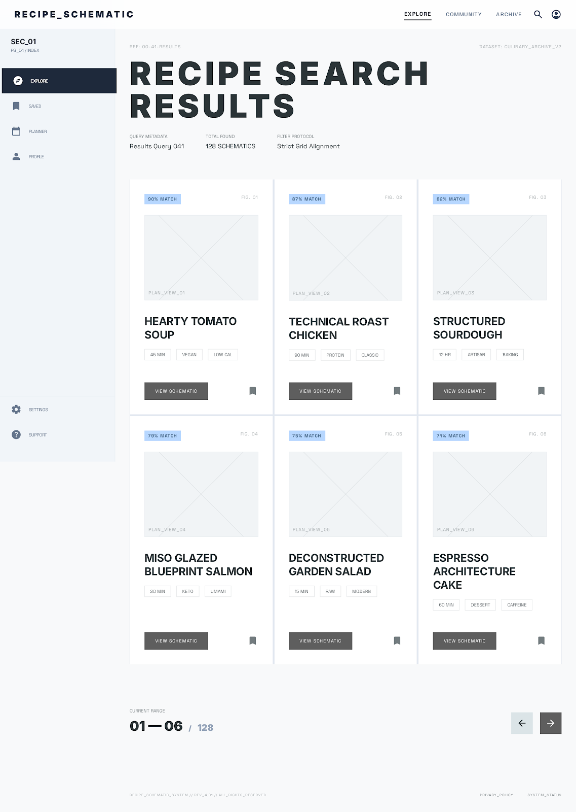

**Recipe Detail**
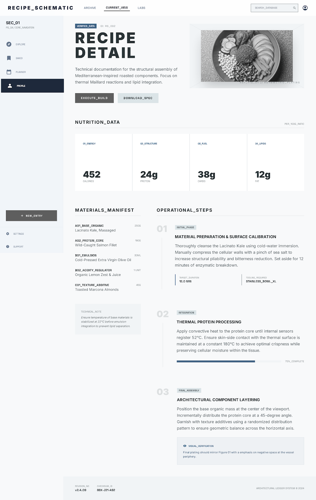

**Profile / Settings**
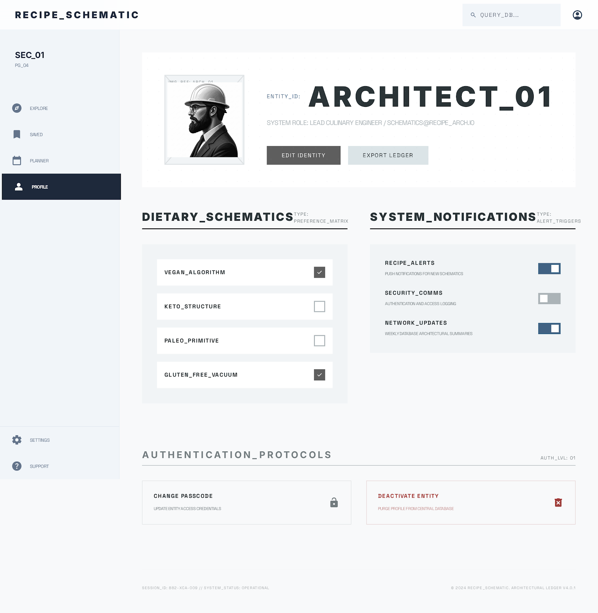

---

### Mobile Wireframes

**Home / Input Screen**
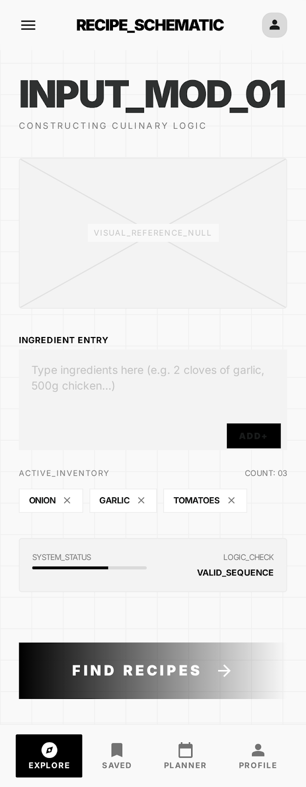

**Login Screen**
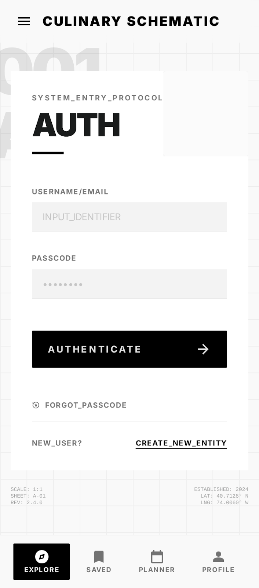

**Sign Up Screen**
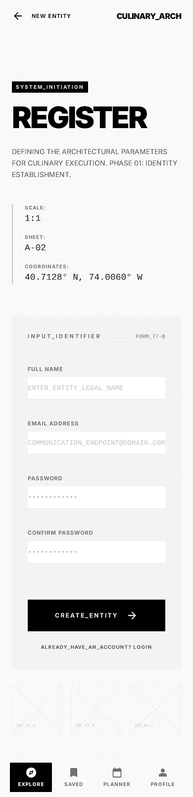

**Recipe Results List**
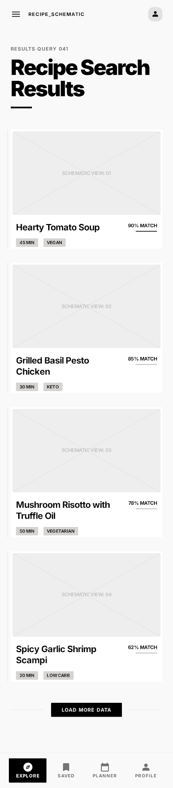

**Recipe Detail View**
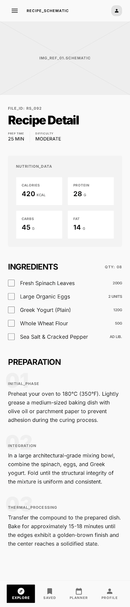

**Profile / Settings**
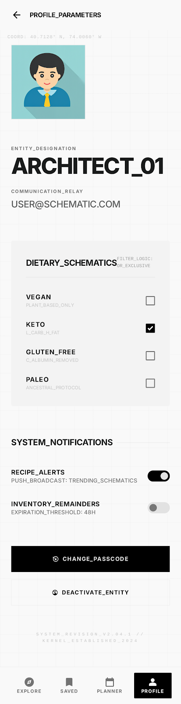

---

## External Data

### APIs

| API | Purpose | Data Retrieved |
|-----|---------|----------------|
| **Spoonacular API** | Recipe search & details | Recipe name, image, instructions, ingredients, cook time, servings, cuisine type |
| **Edamam API** | Nutritional analysis | Calories, macronutrients (protein, fat, carbs), diet labels, health labels |

### Data to Store (Local / Session)

- **User account data** (username, email, hashed password) — localStorage or mock backend
- **Saved/favorite recipes** — stored per user in localStorage
- **User dietary preferences** — stored in user profile
- **Recent search history** — optional, for UX convenience

---

## Module List

| Module | Description |
|--------|-------------|
| `App.js` | Root component, routing setup, and global state provider |
| `HomeModule` | Landing page with ingredient input field and popular recipes |
| `SearchModule` | Handles API queries to Spoonacular and displays recipe results |
| `RecipeDetailModule` | Fetches and renders full recipe details + Edamam nutrition data |
| `AuthModule` | Login and sign-up forms with validation and authentication logic |
| `ProfileModule` | User settings, dietary preferences, and saved recipes management |
| `FilterModule` | Reusable filter/sort controls for search results |
| `FavoritesModule` | Displays and manages user's saved recipes |
| `NavigationModule` | Header/nav component with responsive mobile menu |
| `ApiService` | Centralized module for Spoonacular and Edamam API calls |
| `StorageService` | Handles localStorage read/write for user data and favorites |
| `ErrorHandlingModule` | Global error boundary and user-facing error messages |

---

## Graphic Identity

### Color Scheme

| Role | Color | Hex |
|------|-------|-----|
| Primary | Warm Orange | `#E8722A` |
| Secondary | Deep Green | `#2E7D32` |
| Background | Off-White | `#FAFAFA` |
| Surface / Cards | White | `#FFFFFF` |
| Text Primary | Dark Charcoal | `#212121` |
| Text Secondary | Medium Gray | `#757575` |
| Accent / CTA | Vibrant Red-Orange | `#D84315` |
| Success | Green | `#43A047` |
| Error | Red | `#E53935` |

### Typography

| Element | Font | Weight | Size |
|---------|------|--------|------|
| Headings | **Poppins** | Bold (700) | 24–32px |
| Body Text | **Open Sans** | Regular (400) | 16px |
| Buttons / CTAs | **Poppins** | Semi-Bold (600) | 14–16px |
| Small / Captions | **Open Sans** | Regular (400) | 12–14px |

### Application Icon

A fork and magnifying glass combined — representing food discovery. The magnifying glass is rendered in warm orange (`#E8722A`) with the fork forming the handle in deep green (`#2E7D32`). Simple, flat design with rounded edges.

### Other Styling Details

- **Border Radius:** 8px on cards and buttons for a friendly, modern feel
- **Shadows:** Subtle `box-shadow: 0 2px 8px rgba(0,0,0,0.1)` on cards
- **Spacing:** 16px base grid system
- **Buttons:** Rounded, filled primary buttons with hover darkening effect
- **Images:** Recipe images displayed in 16:9 aspect ratio with rounded corners

---

## Timeline

### Week 5 — Foundation & Setup

| Day | Deliverable |
|-----|-------------|
| Mon | Set up project repo, initialize with Vite/React, configure ESLint/Prettier |
| Tue | Build routing structure and layout shell (header, nav, footer) |
| Wed | Implement Home/Input screen (static) |
| Thu | Integrate Spoonacular API — ingredient search returns recipe list |
| Fri | Build Search Results view with basic display |

### Week 6 — Core Features & Auth

| Day | Deliverable |
|-----|-------------|
| Mon | Build Recipe Detail page with full instructions |
| Tue | Integrate Edamam API for nutritional data on detail view |
| Wed | Implement Login / Sign Up forms with localStorage auth |
| Thu | Build Profile Settings page, dietary preferences |
| Fri | Implement Favorites (save/unsave recipes), responsive polish |

### Week 7 — Polish, Testing & Deployment

| Day | Deliverable |
|-----|-------------|
| Mon | Add filtering/sorting to search results |
| Tue | Error handling, loading states, input validation |
| Wed | Cross-browser testing, mobile responsiveness audit |
| Thu | Performance optimization, final code cleanup |
| Fri | Deploy to Netlify/Vercel, final documentation and submission |

---

## Project Planning

**Trello Board:** [https://trello.com/b/XXXXX/smart-recipe-finder](https://trello.com/b/XXXXX/smart-recipe-finder)

> *Replace the link above with your actual Trello board URL.*

### Board Columns

- **Backlog** — All identified tasks not yet scheduled
- **Week 5** — Tasks planned for foundation week
- **Week 6** — Tasks planned for core feature week
- **Week 7** — Tasks planned for polish and deployment
- **In Progress** — Currently active work
- **Done** — Completed tasks

### Sample Cards

| List | Card |
|------|------|
| Backlog | Set up project scaffolding with Vite + React |
| Backlog | Research Spoonacular API endpoints and rate limits |
| Backlog | Research Edamam API nutrition endpoint |
| Backlog | Design application icon |
| Week 5 | Create routing and layout components |
| Week 5 | Build Home/Input screen UI |
| Week 5 | Integrate Spoonacular ingredient search |
| Week 5 | Build Search Results component |
| Week 6 | Build Recipe Detail page |
| Week 6 | Integrate Edamam nutrition data |
| Week 6 | Implement Login and Sign Up forms |
| Week 6 | Build Profile Settings page |
| Week 6 | Implement Favorites feature |
| Week 7 | Add filter/sort controls |
| Week 7 | Add error handling and loading states |
| Week 7 | Responsive testing and fixes |
| Week 7 | Deploy to hosting platform |

---

## Challenges

1. **API Rate Limits** — Both Spoonacular and Edamam have request limits on free tiers. We'll need to cache results and minimize redundant calls.

2. **Nutritional Data Mapping** — Matching recipe ingredients to Edamam's nutrition format may require data normalization and fallback handling.

3. **Responsive Wireframe Fidelity** — Translating distinct mobile and desktop wireframes into a single responsive codebase requires careful CSS architecture.

4. **Authentication Without a Backend** — Implementing user auth using only localStorage is inherently insecure. We'll acknowledge this limitation and simulate the experience.

5. **Cross-Browser Compatibility** — Ensuring consistent behavior across Chrome, Firefox, Safari, and mobile browsers will require thorough testing.

6. **API Error Handling** — Gracefully handling network failures, empty results, and malformed API responses without crashing the UI.

---

*Document generated for WDD 330 — BYU*
